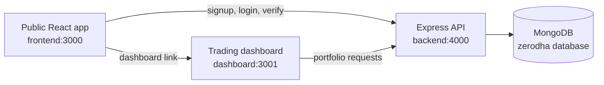

# Zerodha Clone

An educational full-stack clone of the Zerodha/Kite experience. The project combines a public brokerage-style website, an authenticated trading dashboard, and an Express/MongoDB API for simulated portfolio and order management.

> **Disclaimer:** This project is for learning and demonstration purposes only. It is not affiliated with Zerodha, does not connect to a real broker or stock exchange, and must not be used for real-money trading or financial decisions.

## Contents

- [Overview](#overview)
- [Live Demo](#live-demo)
- [Features](#features)
- [Architecture](#architecture)
- [Technology Stack](#technology-stack)
- [Project Structure](#project-structure)
- [Prerequisites](#prerequisites)
- [Getting Started](#getting-started)
- [Environment Variables](#environment-variables)
- [Available Scripts](#available-scripts)
- [API Reference](#api-reference)
- [Data Model](#data-model)
- [Build and Deployment](#build-and-deployment)
- [Testing and Linting](#testing-and-linting)
- [Known Limitations](#known-limitations)
- [Contributing](#contributing)
- [License](#license)

## Overview

Zerodha Clone is a portfolio project that recreates the main flows of an online investing platform:

- A marketing and account access site for browsing product information, pricing, support, signup, and login.
- A Kite-inspired dashboard for viewing simulated holdings, positions, orders, trades, funds, watchlists, and profile information.
- A REST API that handles user authentication and persists simulated trading data in MongoDB.

The public site and trading dashboard are separate React applications so they can be developed and deployed independently. The backend is a separate Node.js service consumed by both applications.

## Live Demo

- **Frontend:** [https://gentle-hill-094431600.2.azurestaticapps.net](https://gentle-hill-094431600.2.azurestaticapps.net)
- **Kite Dashboard:** [https://jolly-stone-0de248a00.1.azurestaticapps.net/](https://jolly-stone-0de248a00.1.azurestaticapps.net/)

Open the frontend first, create an account or log in, and then use the dashboard link to access the Kite dashboard.

## Features

### Public website

- Responsive landing page with home, about, products, pricing, and support sections.
- Signup and login forms connected to the backend API.
- Cookie/JWT-based authentication state.
- Navigation into the authenticated dashboard demo after login.
- Toast notifications and an error boundary for a more resilient UI.

### Trading dashboard

- User-specific dashboard routes under `/:userId`.
- Summary view with portfolio information and charts.
- Holdings, positions, orders, trades, funds/wallet, and profile views.
- Watchlist with simulated instruments and price movement indicators.
- Buy flow that creates an order, holding, and position while updating the wallet.
- Sell flow that closes the related holding and position and records a trade.
- Sorting, search, loading states, toast feedback, and tabular portfolio views.

### Backend

- Express 5 REST API with CORS, JSON parsing, cookies, and centralized error handling.
- MongoDB persistence through Mongoose.
- Signup with password hashing using `bcrypt`.
- Login and token verification using JSON Web Tokens.
- Wallet creation with a simulated starting balance for new users.
- CRUD-style endpoints for simulated orders and related portfolio records.

## Architecture



Authentication is initiated by the public frontend. The backend returns a JWT in a cookie and the dashboard uses the authenticated user slug in its route, for example `/:userId/dashboard`.

## Technology Stack

| Area | Technologies |
| --- | --- |
| Public frontend | React 19, React Router, Axios, React Toastify, Bootstrap 5 |
| Trading dashboard | React 19, React Router, Material UI, Chart.js, Axios, React Toastify |
| Backend | Node.js, Express 5, Mongoose, MongoDB, CORS, cookie-parser |
| Authentication | JWT, bcrypt, Passport-related packages |
| Tooling | Create React App, ESLint, Jest/React Testing Library, Nodemon |

## Project Structure

```text
.
├── backend/                 # Express API, authentication, controllers, models, and schemas
│   ├── controllers/         # Auth and dashboard request handlers
│   ├── middlewares/         # Authentication and request verification
│   ├── models/              # Mongoose models
│   ├── routes/              # Auth and dashboard routes
│   ├── schemas/             # Mongoose schemas
│   └── index.js             # API entry point
├── dashboard/               # Authenticated trading dashboard React app
│   └── src/components/      # Dashboard pages, tables, order actions, and layout
├── frontend/                # Public React website and account flows
│   └── src/landing_page/    # Home, products, pricing, support, signup, and login
└── README.md
```

## Prerequisites

- Node.js 18 or newer. The backend's `bcrypt` dependency requires Node.js 18+.
- npm.
- A MongoDB database, local or hosted through MongoDB Atlas.
- Three available local ports. The configuration below uses:
	- Public frontend: `3000`
	- Trading dashboard: `3001`
	- Backend API: `4000`

## Getting Started

### 1. Clone the repository

```bash
git clone <repository-url>
cd Zerodha_Clone
```

### 2. Install dependencies

Each application has its own package manifest:

```bash
cd backend && npm install
cd ../frontend && npm install
cd ../dashboard && npm install
```

### 3. Configure environment variables

Create the files described in [Environment Variables](#environment-variables).

### 4. Start the services

Open three terminals from the repository root.

```bash
# Terminal 1: API
cd backend
npm start
```

```bash
# Terminal 2: public website
cd frontend
npm start
```

```bash
# Terminal 3: trading dashboard
cd dashboard
npm start
```

Open `http://localhost:3000` for the public website. After creating an account or logging in, use the dashboard link to open the trading interface at `http://localhost:3001`.

The backend defaults to port `3001`, which conflicts with the dashboard's configured port. Set `PORT=4000` in `backend/.env` as shown below when running all three services together.

## Environment Variables

### `backend/.env`

```env
PORT=4000
MONGODB_ATLAS_URL=mongodb+srv://<username>:<password>@<cluster>/<database>
TOKEN_KEY=replace-with-a-long-random-secret
```

`MONGODB_ATLAS_URL` is required. `TOKEN_KEY` is required for signing and verifying JWTs. Never commit real credentials or production secrets.

### `frontend/.env`

```env
REACT_APP_API_URL=http://localhost:4000
REACT_APP_ZERODHA_DASHBOARD=http://localhost:3001
```

### `dashboard/.env`

```env
REACT_APP_API_URL=http://localhost:4000
REACT_APP_ZERODHA_CLONE=http://localhost:3000
```

Create React App reads environment variables at startup, so restart the relevant development server after changing an `.env` file.

## Available Scripts

Run these commands inside the indicated package directory.

| Directory | Command | Purpose |
| --- | --- | --- |
| `backend` | `npm start` | Start the API with Nodemon |
| `frontend` | `npm start` | Start the public React app on port 3000 |
| `frontend` | `npm run build` | Create a production build |
| `frontend` | `npm test` | Run frontend tests in watch mode |
| `frontend` | `npm run lint` | Lint source files |
| `dashboard` | `npm start` | Start the dashboard on port 3001 |
| `dashboard` | `npm run build` | Create a production build |
| `dashboard` | `npm test` | Run dashboard tests in watch mode |
| `dashboard` | `npm run lint` | Lint source files |

Both React packages also expose `lint:all` and the Create React App `eject` script. Ejecting is irreversible and is not required for normal development.

## API Reference

The examples below assume `API_URL=http://localhost:4000` and use a user slug as `userId`.

### Authentication

| Method | Endpoint | Description |
| --- | --- | --- |
| `POST` | `/signup` | Create a user and initialize a wallet |
| `POST` | `/login` | Authenticate a user and issue a JWT cookie |
| `GET` | `/verify` | Verify a bearer token and return the user |

### Dashboard resources

| Method | Endpoint | Description |
| --- | --- | --- |
| `GET` | `/:userId` | Resolve a user by slug |
| `GET` | `/:userId/profile` | Return profile data |
| `GET` | `/:userId/holdings` | Return holdings and portfolio totals |
| `GET` | `/:userId/watchlists` | Return the simulated watchlist |
| `GET` | `/:userId/positions` | Return open positions |
| `GET` | `/:userId/orders` | Return orders |
| `POST` | `/:userId/orders` | Create a simulated buy order and portfolio records |
| `GET` | `/:userId/trades` | Return completed trades |
| `GET` | `/:userId/wallet` | Return wallet balances and profit/loss |
| `DELETE` | `/:userId` | Complete a simulated sell operation using order data |

The API currently expects JSON request bodies for signup, login, order creation, and sell operations. Token verification uses the header format `Authorization: Bearer <token>`.

## Data Model

The backend stores the following main entities in MongoDB:

- `User`: email, username, hashed password, and URL-safe user slug.
- `Wallet`: available balance, amount spent, and net profit/loss.
- `Holding`: owned instrument quantity, average price, current value, and P/L.
- `Position`: product, quantity, average price, last traded price, and P/L.
- `Order`: order time, instrument, product, type, quantity, price, status, and average price.
- `Trade`: completed trade details and realized profit/loss.
- `WatchList`: simulated instrument prices, opening prices, and daily percentage changes.

## Build and Deployment

Build each React application independently:

```bash
cd frontend && npm run build
cd ../dashboard && npm run build
```

The generated static files are written to each package's `build/` directory. Deploy the two builds to static hosting and run the backend as a Node.js service. Configure the production environment variables with the deployed frontend/dashboard URLs, update the backend CORS allowlist in `backend/index.js`, and use a production MongoDB connection string.

The repository includes generated build output in both React packages. For repeatable deployments, prefer building from source in CI and publishing the resulting artifacts.

## Testing and Linting

The React applications use Create React App's test runner and React Testing Library. Run the available checks before opening a pull request:

```bash
cd frontend && npm test -- --watchAll=false
cd ../frontend && npm run lint
cd ../dashboard && npm test -- --watchAll=false
cd ../dashboard && npm run lint
```

The backend does not currently define a test script. API behavior should be verified against a disposable MongoDB database during development.

## Known Limitations

- Market data is static demo data; there is no live exchange feed, broker API, or real-time price streaming.
- Orders and portfolio calculations are simulated and are not suitable for financial use.
- The backend currently relies on a user slug in the URL for dashboard resource lookup.
- Backend route authorization is limited; protect resource routes with robust token and ownership checks before production use.
- There is no password reset, email verification, role management, rate limiting, or production observability setup.
- The backend and dashboard have separate default port assumptions; use the environment configuration above to avoid a local port collision.
- Error handling, validation, and transaction boundaries should be strengthened before production deployment.

## Contributing

1. Fork the repository and create a focused feature branch.
2. Install dependencies in the affected package directories.
3. Add or update tests for behavior changes where practical.
4. Run the relevant build, test, and lint commands.
5. Open a pull request describing the change, verification performed, and any known limitations.

Please keep changes focused, avoid committing secrets or generated credentials, and preserve the educational/demo nature of the project.

## License

No root-level license has been specified yet. Add a license file before distributing this project as an open-source work.